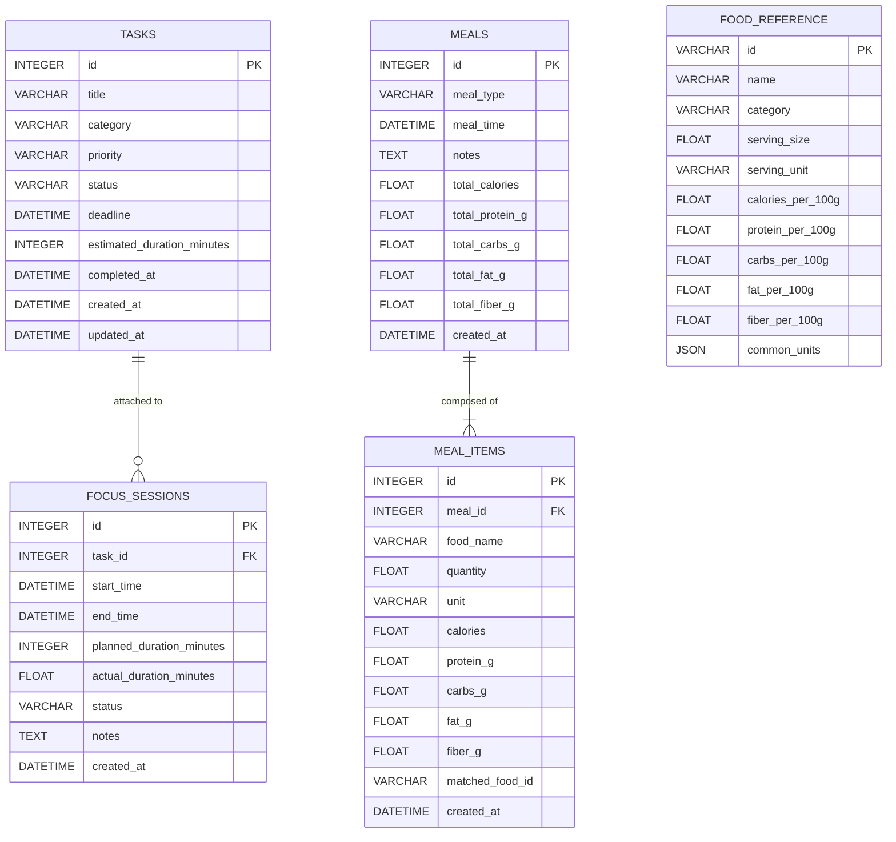

# LifeLens — Personal Productivity & Nutrition Analytics Web App

[](https://lifelens-71om.onrender.com/)
[](https://fastapi.tiangolo.com/)
[](https://www.python.org/)

> **🌐 Live Web Application:** [https://lifelens-71om.onrender.com/](https://lifelens-71om.onrender.com/)  
> **📖 Interactive API Docs (Swagger):** [https://lifelens-71om.onrender.com/docs](https://lifelens-71om.onrender.com/docs)

LifeLens is a personal productivity and metabolic fuel tracking platform designed to bridge cognitive performance analytics with nutritional chrono-distribution.

---

## 1. Problem Statement

Knowledge workers, students, and athletes often struggle to identify how daily dietary timing and macronutrient composition affect cognitive stamina, focus duration, and task execution accuracy. Standard productivity apps (like generic Pomodoro timers or to-do lists) completely ignore physiological fuel states, while standard calorie-counting apps operate in total isolation from work commitments.

LifeLens unites these domains into a single, unified local-first analytics dashboard—enabling users to detect cognitive drift, correlate meal timing with sustained focus blocks, and pace their priorities with physiological awareness.

---

## 2. Architecture Diagram

```
+-------------------------------------------------------------------------+
|                              LifeLens UI                                |
|   Modern Precision Minimalist SPA (Hanken Grotesk / Botanical Teal)      |
|  [Dashboard View]  [Task Priorities]  [Pomodoro Timer]  [Meal Logging]   |
|         |                   |                 |                |        |
|         +-------------------+--------+--------+----------------+        |
|                                      |                                  |
|                         Plotly.js Interactive Charts                    |
+--------------------------------------|----------------------------------+
                                       | HTTP JSON (FastAPI)
+--------------------------------------v----------------------------------+
|                            FastAPI Backend                              |
|  /api/tasks     /api/timer/sessions     /api/meals     /api/analytics    |
+--------------------------------------|----------------------------------+
|               Service Layer & Data Processing Pipelines                 |
|  - task_service.py       : CRUD & status velocity                        |
|  - timer_service.py      : Pomodoro duration & drift calculations        |
|  - nutrition_service.py  : Local USDA lookup & gram/unit scaling engine |
|  - analytics_service.py  : Pandas/NumPy aggregations & Plotly specs      |
|  - llm_service.py        : Isolated, swappable NLP/Synthesis interface  |
+--------------------------------------|----------------------------------+
                                       | SQLAlchemy 2.0 ORM
+--------------------------------------v----------------------------------+
|                          Data Storage Layer                             |
|  - SQLite (lifelens.db)  : tasks, focus_sessions, meals, meal_items     |
|  - Curated USDA Subset   : data/usda_foods.json (FoodReference Table)   |
+-------------------------------------------------------------------------+
```

---

## 3. Explicit Database Schema

The database is powered by **SQLite** through **SQLAlchemy 2.0**.

### Entity Relationship Diagram



---

## 4. Dataset & APIs Used

### Local Bundled Nutrition Reference
- **Source**: Curated offline subset of the **USDA FoodData Central** database (`data/usda_foods.json`).
- **Scope**: Common dietary staples across proteins, eggs, dairy, grains, produce, nuts, fats, and recovery supplements.
- **Unit Resolution Engine**: Handles conversions across grams (`g`), ounces (`oz`), cups, tablespoons (`tbsp`), slices, whole pieces, and standard USDA reference servings.
- **Offline Reliability**: Zero external API calls required in Phase 1.

### LLM Architecture (Phase 2 & Phase 3 Ready)
- The architecture isolates LLM dependencies inside `app/services/llm_service.py` behind `BaseLLMService`.
- A deterministic `MockLLMService` is active in Phase 1 for fast testing.
- Swapping to Gemini 1.5/2.0 or other providers in Phase 2 (AI Meal Parser) and Phase 3 (AI Daily Analyst) requires zero modifications to database models or API routes.

---

## 5. Feature Engineering Notes

1. **Cognitive Drift / Variance**:
   $$\text{Variance (mins)} = \text{Actual Duration} - \text{Estimated Duration}$$
   Positive variance indicates cognitive drift or scope overrun; negative variance indicates superior velocity.
2. **Macronutrient Fuel Density**:
   Sum of caloric and protein contributions calculated per food item scaled to actual gram weight.
3. **Chrono-Distribution**:
   Maps meal timestamps against focus session start and finish times to highlight pre- and post-prandial focus efficiency.

---

## 6. Statistical & Data Science Roadmap

- **Phase 1 (Active)**: Descriptive statistics, time-series aggregations, and Plotly interactive visualizations.
- **Phase 2 (Next)**: Few-shot natural language prompt parsing for free-text meal extraction.
- **Phase 3 (Next)**: AI Daily Analyst synthesizing weekly behavioral deviations against the user's historical rolling mean.
- **Phase 4 (Next)**: Ordinary Least Squares (OLS) duration overrun regression, Pearson/Spearman correlation matrices between macronutrient split and focus block length, and DBSCAN/k-Means clustering for chronotype performance windows.

---

## 7. Limitations & Constraints

- **Single User Desktop Deployment**: Optimized for individual personal productivity on localhost.
- **Subset Nutrition Coverage**: The local USDA dataset covers frequent staple foods; custom or branded packaged foods fall back to generic macro approximations unless explicitly added to `data/usda_foods.json`.
- **Subjective Estimations**: Task durations rely on user-estimated inputs; accuracy improves as historical focus sessions accumulate.

---

## 8. Privacy & Local-First Security

> [!IMPORTANT]
> **Zero External Transmission**: LifeLens handles personal health-adjacent data (food intake, daily focus timestamps, work tasks). In Phase 1, **all data is stored strictly in your local SQLite database (`lifelens.db`) on your disk**. No data is ever transmitted, logged, or shared externally.

---

## 9. Medical & Healthcare Disclaimer

> [!CAUTION]
> **LifeLens is strictly a personal behavioral productivity and nutrition self-reflection tool, NOT a medical diagnostic system or healthcare advisory.**
> The metrics, caloric values, macronutrient distributions, and automated observations are provided solely for personal habit optimization and cognitive pacing. They do not constitute medical, clinical, or dietary diagnosis or advice.

---

## 10. Quick Start & Verification

### Running the Application Locally & on Mobile

1. Install Python dependencies:
   ```bash
   pip install -r requirements.txt
   ```
2. Start the FastAPI server (listening on all network interfaces):
   ```bash
   python -m uvicorn app.main:app --host 0.0.0.0 --port 8000 --reload
   ```
3. **Desktop**: Open `http://127.0.0.1:8000`
4. **Mobile (on the same Wi-Fi)**:
   Find your computer's local IP address (e.g. `ipconfig` on Windows or `ifconfig` on Mac/Linux, such as `192.168.1.16`). Open your phone's browser and go to:
   ```
   http://<YOUR_LOCAL_IP>:8000
   # Example: http://192.168.1.16:8000
   ```

### 1-Click Free Cloud Deployment (24/7 Web Access)

You can deploy LifeLens directly to cloud hosting platforms from this GitHub repository:

- **Render** ([render.com](https://render.com)):
  - **Active Live Web URL**: **[https://lifelens-71om.onrender.com/](https://lifelens-71om.onrender.com/)**
  - Continuous deployment configured via `render.yaml`. Every push to `main` auto-deploys.

- **Railway** ([railway.app](https://railway.app)):
  1. Click **New Project** -> **Deploy from GitHub repo** -> Select `LifeLens`.
  2. Railway automatically detects `Dockerfile` / `Procfile` and assigns a public HTTPS domain.

- **Vercel** ([vercel.com](https://vercel.com)):
  1. Import Git repository -> Select `LifeLens`.
  2. Vercel uses `vercel.json` to deploy the FastAPI application serverlessly.

### Running Automated Tests
```bash
pytest -v
```

